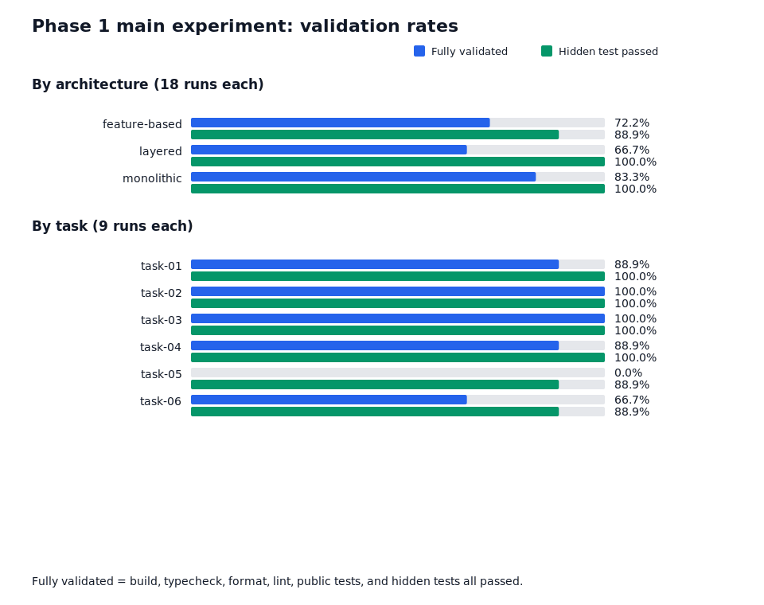
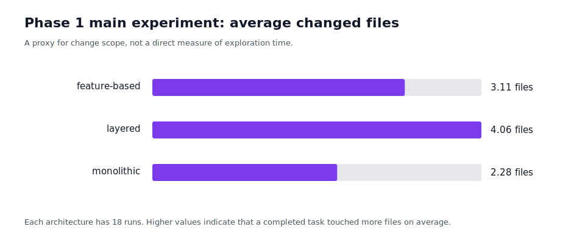

# AIはどんな設計を変更しやすいのか？TypeScript APIを3構成・54 Runで比較してみた

> 下書き。公開前に著者情報、図の説明、代表差分へのリンクを確認する。

## 結論

この小規模TypeScript/Fastifyアプリでの54 Runでは、完全検証通過率は monolithic が83.3%、feature-based が72.2%、layered が66.7%だった。一方、この実験で測った要件適合性に近い隠しテスト通過率は monolithic と layered が100%、feature-based が88.9%だった。

monolithicでは変更対象が平均2.28ファイルに収まり、少なくとも編集範囲は他構成より狭かった。これが探索負荷の低下にもつながった可能性がある。一方layeredは隠しテストを全Runで通過しながら完全検証に失敗したRunがあり、実装内容以外の品質ゲートも結果へ影響している。

ただし、この結果だけで「単一ファイル構成がAIに最適」とは結論づけない。Task 05には共有公開契約と課題仕様の不整合があり、完全検証通過率を押し下げている。また、各条件は3回ずつであり、モデルやプロンプト、課題の難度による影響を完全には分離できない。



## 先に見るべき2つの指標

この記事では、次の2軸を分けて扱う。

| 指標       | 意味                                                                                     |
| ---------- | ---------------------------------------------------------------------------------------- |
| 要件適合性 | 隠しテスト通過率。公開されていない評価ケースを含め、課題要件を満たしたか。               |
| 開発品質   | 完全検証通過率。build、typecheck、format、lint、公開テスト、隠しテストをすべて通したか。 |

この区別がないと、整形だけで落ちたRunと要件を実装できなかったRunを同じ失敗として扱ってしまう。

## なぜ検証したのか

人間にとって保守しやすい分割が、AIが既存コードを探索し、変更し、テストまで通す際にも有利なのかを確かめたかった。比較したのは、同じタスクAPIを異なる構成で実装した次の3条件である。

| 構成          | 特徴                                       |
| ------------- | ------------------------------------------ |
| monolithic    | 主要な処理を1ファイルに集約                |
| layered       | domain / repository / service / HTTPを分離 |
| feature-based | task機能単位に実装を集約                   |

仕様、課題、Baseline、隠しテスト、評価手順は実験前に固定した。詳細は[プロジェクト計画書](../PROJECT_PLAN.md)、[実験プロトコル](../EXPERIMENT_PROTOCOL.md)、[評価基準](../EVALUATION_RULES.md)を参照してほしい。

## 実験方法

3構成 × 6課題 × 各3回、合計54 Runを実行した。Runnerは対象コードと公開情報だけを扱い、Evaluatorは別cloneで公開検証と隠しテストを実施した。各RunではGit差分、評価JSON、公開・隠しテストの結果を保存し、GitHub PRとして公開している。

完全検証通過は、build・typecheck・format・lint・公開テスト・隠しテストがすべて通ったRunと定義した。

## 結果を読む前の注意: Task 05は主たる設計比較から分離する

Task 05では、共有公開契約がDELETEの204応答を期待していたのに対し、課題仕様は200と`ARCHIVED`応答を要求していた。この契約不整合により6 Runが公開検証で失敗した。

これはAIの変更品質ではなく評価条件の競合である。以降の構成比較では、Task 05の公開テスト失敗をそのまま設計差として解釈しない。

## 結果

| 構成          | 全54 Runでの完全検証率 | Task 05除外時 |    要件適合性 | 平均変更ファイル数 |
| ------------- | ---------------------: | ------------: | ------------: | -----------------: |
| monolithic    |          15/18 (83.3%) |  15/15 (100%) |  18/18 (100%) |               2.28 |
| feature-based |          13/18 (72.2%) | 13/15 (86.7%) | 16/18 (88.9%) |               3.11 |
| layered       |          12/18 (66.7%) | 12/15 (80.0%) |  18/18 (100%) |               4.06 |

Task 05を除くと完全検証通過率は monolithic 100%、feature-based 86.7%、layered 80.0%となる。Task 05の不整合は全構成に影響しており、完全検証率の構成差を読むときはこの参考値も併記する。

技術的な品質ゲートでの失敗内訳は次のとおり。Task 05の契約不整合とは別に数えている。

| 構成          | format失敗 | lint失敗 | typecheck失敗 | 隠しテスト失敗 |
| ------------- | ---------: | -------: | ------------: | -------------: |
| monolithic    |          0 |        0 |             0 |              0 |
| feature-based |          1 |        0 |             1 |              2 |
| layered       |          3 |        0 |             0 |              0 |

Task 02とTask 03は9 Runすべてが完全検証を通過した。Task 06は変更量が最も大きく、平均108.2行の追加が必要だった。さらにfeature-basedのTask 06 Run 01では、重複ルート登録と型エラーにより隠しテストにも失敗した。このRunは失敗例として改変せず残している。



平均変更ファイル数は、厳密な探索時間ではない。しかし、layeredで平均4.06ファイル、feature-basedで3.11ファイル、monolithicで2.28ファイルとなり、構成ごとの変更範囲の違いを示す補助指標にはなる。

## 成功例と失敗例

成功例として、Task 03（変更履歴追加）は全構成・全Runで完全検証を通過した。既存の責務分離に沿って、イベントの保存、取得、HTTP応答を小さく追加できたことが共通点だった。

代表例は[layered / Task 03 / Run 01のPR](https://github.com/naki0227/ai-readable-code-lab/pull/67)で確認できる。評価条件やログはPR、純粋なBefore／Afterは[Baselineとの比較](https://github.com/naki0227/ai-readable-code-lab/compare/p1-layered-v1.0.1...b9f0b1a33d106d96ae987eb51d9cf59ff79fca75)で追える。差分では、履歴の型をdomainへ、保存をrepositoryへ、イベント記録をserviceへ、HTTP endpointをappへ配置している。

```diff
+ app.get('/tasks/:id/history', ...)
+ export type TaskHistoryItem = { id; taskId; action; createdAt }
+ repository.saveHistory(...)
+ service.recordHistory(task.id, 'CREATED', time)
```

Task 03は複数レイヤーを横断する課題だったが、既存のTask作成・更新処理に履歴記録を追加する形で実装できた。各構成に類似する既存処理があり、それを模倣できたことが、全構成での成功率の高さにつながった可能性がある。

失敗例として、[feature-based / Task 06 / Run 01のPR](https://github.com/naki0227/ai-readable-code-lab/pull/72)では、同じHTTPルートを二重登録し、型エラーも発生した。複製機能を追加する過程で、既に存在していた`category`フィールドも重複して追加していた。Evaluatorが保存した実際のエラーは次のとおりである。

```text
error TS2300: Duplicate identifier 'category'.
FastifyError: Method 'POST' already declared for route '/tasks/:id/duplicate'
```

この1 Runでは、同じルートに関する実装箇所を正しく把握できず、重複登録が発生した。ただし、feature-based全体の性質と断定するには試行数が不足している。これは編集済みのスクリーンショットではなく、[Evaluatorの公開ログ](https://github.com/naki0227/ai-readable-code-lab/pull/72/files)で追跡できる生の失敗記録である。

## AIにとって読みやすいコードとは何か

今回の結果からは、AIにとっての読みやすさを、単純なファイル数やアーキテクチャ名だけでは説明できなかった。変更対象が少ないことは小規模変更で有利に働く一方、複数ファイルへ分かれていても、依存方向と命名が一貫していれば要件自体は正しく実装できていた。反対に、関連コードが近くにあっても、同じ責務を扱う実装箇所を見落とすと重複実装が起きた。重要なのは、コードが集約されていることよりも、変更時に参照すべき場所を一意に判断できることだと考えている。

- 小規模な変更では、monolithicでも高い通過率を示した。
- ファイル数そのものより、必要な情報が近くにあり、命名規則と既存パターンが統一されていることが重要そうだった。
- layeredは隠しテストを全Runで通過した一方、変更ファイル数が最も多く、整形失敗が完全検証率に影響した。
- feature-basedは大半で通過したが、複数の近接実装箇所をまたぐ変更では重複実装の失敗が起きた。
- 単一の通過率ではなく、隠しテスト、失敗分類、変更量を併記する必要がある。

## 限界

- 各条件は3回であり、統計的な一般化には不十分である。
- 人間によるブラインドな設計品質評価はまだ実施していない。
- 実行時間、トークン使用量、探索ログは全Runで同じ粒度に揃っていない。
- Fastifyを用いた小規模アプリの結果であり、UI、DB、外部APIを含む大規模システムへ直接一般化できない。
- 今回のRunnerモデルはGPT-5.6 Terraのみであり、モデルが変われば結果も変わる可能性がある。

## 再現方法

実験順序と集計結果はリポジトリに公開している。実験ブランチを取得した後、次のコマンドで集計を再生成できる。

```sh
git fetch origin 'refs/heads/experiment/p1/*:refs/remotes/origin/experiment/p1/*'
npm ci
npm run summarize:main-experiment
```

生成される[JSON集計](../../results/summaries/main-experiment-summary.json)と[CSV](../../results/summaries/main-experiment-runs.csv)には、全54 Runの検証結果とPRリンクを含めている。

## 次にやること

次の実験では、Task 05のような契約不整合を実行前に検出する仕組みを追加する。その上で、人間によるブラインド評価と、より大きな変更課題を加える。

第2弾では設計を固定したまま、Python、TypeScript、Go、Rustを比較し、型システムとコンパイラがAIのコード変更へ与える影響を検証する予定である。
